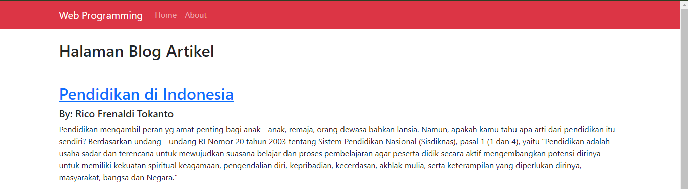
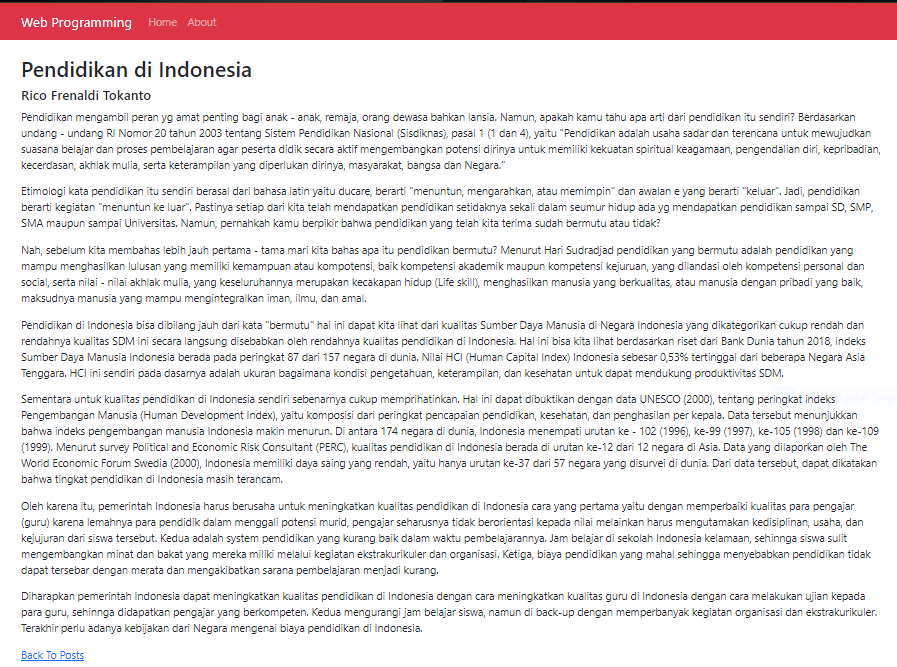
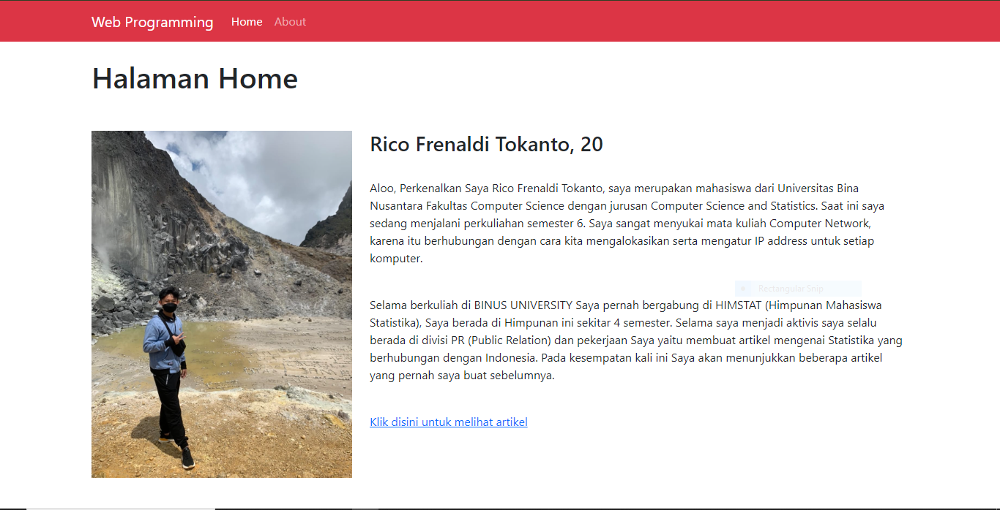
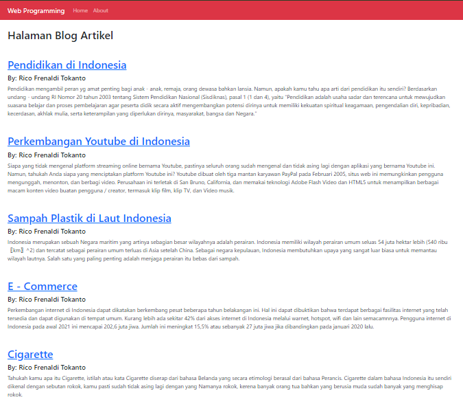

# Tugas Individu
## 2440114373 - Rico Frenaldi Tokanto

Repository ini dibuat untuk memenuhi tugas Session 7 yang berkaitan dengan pembuatan program One-to-One dan One-to-Many.
Disini Saya membuat semacam web yang dimana terdapat 2 fitur yaitu 'Home' dan 'About'. Fitur 'Home' ini berisi informasi mengenai user serta di bawahnya terdapat link yang menghubungkan ke sebuah blog yang berisi artikel yang telah dibuat oleh user tersebut.
1. Relasi One-to-One: Terletak pada saat berada di user profile. Jadi di bagian bawah dapat dilihat ada link 'Klik disini untuk melihat artikel' yang akan memandu user berada di blog Artikel dimana di page tersebut terdapat 5 judul artikel, user bisa klik salah satu dari kelima judul tersebut kemudian user akan diarahkan ke satu page baru yang berisi informasi penuh mengenai artikel tersebut. Jadi page blog artikel itu cuma seperti sekedar headline. Jadi dapat dikatakan bahwa satu user akan memiliki satu blog artikel tersendiri.
    - Berikut ini tampilan page blog artikel:
    
    - Berikut ini tampilan page full page artikel:
    
Jadi, user memiliki blog artikel masing - masing dan terhubung satu sama lain.

2. Relasi One-to-Many: Terletak pada saat anda berada pada page 'Home' dimana di bagian bawah setelah profile, kamu akan melihat tulisan 'Klik disini untuk melihat artikel', jika user klik link tersebut maka akan diarahkan ke page blog artikel yang dimana pada page tersebut ada 5 judul artikel. Kondisi One-to-Many terletak itu disini, karena di dalam satu blog artikel user tersebut terdapat berbagai judul artikel.
    - Tampilan 'Home':
    
    - Tampilan penuh blog artikel:
    
